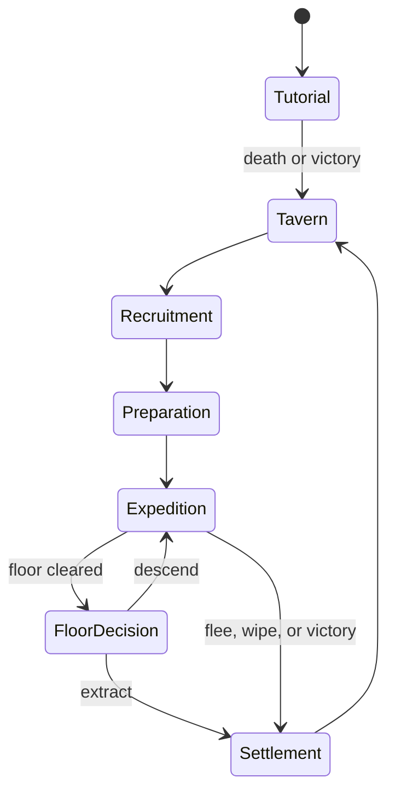

# Tavernbound — Implementation-Grade Game Loop Plan

**Document purpose:** Define the complete playable loop, system boundaries, formulas, data contracts, balancing targets, failure cases, and implementation order for a tavern-management roguelite in which the player recruits, equips, and sends adventurers into dangerous expeditions.

**Status:** Recommended baseline. Numeric values are starting targets for playtesting, not final balance.

---

## 1. Game Thesis

The player owns a struggling tavern that functions as both a business and an adventurer guild. Each cycle, the player evaluates partially unknown recruits, spends limited tavern resources to prepare a party, directly controls that party through a dungeon expedition, and decides repeatedly whether to press deeper or return safely. Survivors repay their tab and become recurring characters; deaths create economic loss, stories, inheritance opportunities, and new recruitment needs. Tavern improvements attract stronger or more unusual recruits and unlock new ways to influence future expeditions.

### Core fantasy

> Turn an unreliable roadside tavern into a legendary adventurer haven by recognizing potential, taking calculated risks, and bringing heroes home alive.

### Design pillars

1. **Informed uncertainty:** Recruits are not loot boxes. Their exact qualities are initially hidden, but the player can gather useful evidence through tavern interactions.
2. **Preparation matters:** Food, drink, lodging, equipment, and party composition materially affect a run without predetermining it.
3. **Extraction creates tension:** Every cleared dungeon floor ends with a meaningful choice between banking the haul and risking it for greater rewards.
4. **Characters create history:** Survivors develop relationships, traits, injuries, and reputations. Death matters, but does not erase all progress.
5. **The tavern is the progression spine:** Expeditions generate resources; resources improve the tavern; the tavern expands strategic options rather than merely increasing numbers.

### Player-controlled roles

The player is always the **tavern keeper strategically** and controls the **selected adventuring party tactically** during expeditions. Adventurers are persistent roster characters, not autonomous timers. This preserves the strongest parts of both management and roguelike play while keeping one clear player identity.

---

## 2. Loop Hierarchy

### Moment-to-moment combat loop (5–20 seconds)

1. Read threats, terrain, cooldowns, and party status.
2. Select an adventurer and one of their available actions.
3. Resolve movement, attack, special, or defensive reaction.
4. Enemies act according to telegraphed intent.
5. Reassess positioning, resources, and escape options.

### Room loop (1–4 minutes)

1. Enter room and reveal its type.
2. Resolve combat, event, merchant, hazard, camp, or treasure interaction.
3. Receive rewards and consequences.
4. Choose the next room or path.

### Floor loop (10–20 minutes)

1. Generate the floor from the dungeon profile and current depth.
2. Traverse rooms while managing health, supplies, equipment durability, and temporary effects.
3. Defeat the floor guardian or complete the floor objective.
4. Choose **Extract**, **Descend**, or a special route when unlocked.

### Expedition loop (25–60 minutes)

1. Select a destination and objective.
2. Assemble and provision a party.
3. Clear one or more floors.
4. Extract voluntarily, complete the destination, flee, or suffer a wipe.
5. Settle rewards, tabs, injuries, deaths, relationships, and unlocks.

### Tavern cycle (8–15 minutes)

1. Receive returning adventurers and expedition results.
2. Run the tavern service phase and earn operating income.
3. Meet, assess, recruit, dismiss, and socialize with candidates.
4. Craft, repair, buy, sell, and upgrade.
5. Select an expedition and prepare its party.

### Campaign loop (8–20 hours for first completion)

1. Restore the tavern from Tier 0 to Tier 5.
2. Discover and master the Forest, Crypt, and Hell regions.
3. Build a roster capable of defeating the final Hell expedition.
4. Resolve the former tavern keeper storyline.
5. Continue into higher difficulties, seasonal modifiers, roster legacies, and challenge expeditions.

---

## 3. Canonical Game-State Flow



Use a single authoritative campaign state machine. UI screens may change, but state transitions must occur only through validated commands such as `begin_recruitment`, `launch_expedition`, `extract_party`, and `settle_expedition`. This prevents rewards, deaths, or costs from being applied twice when scenes reload.

### Saved states

Autosave at these transaction boundaries:

- On entering the tavern after settlement.
- Immediately after confirming recruitment, purchases, or upgrades.
- At expedition launch.
- At the start of each dungeon floor.
- After resolving extraction, victory, flee, or wipe.

Never save halfway through reward settlement. Calculate a complete `SettlementResult`, commit it once, then save.

---

## 4. Opening and Tutorial

### Tutorial purpose

Teach combat, extraction, death, and the tavern premise in no more than 20 minutes. The tutorial outcome may branch narratively, but must converge mechanically so neither success nor failure is the optimal metagame choice.

### Sequence

1. The player controls a preset adventurer entering the Forest.
2. The game teaches movement, basic attack, special action, defensive reaction, consumables, and room rewards.
3. Before the boss, the player sees the first Extract/Descend choice.
4. The tutorial concludes in victory or death.
5. The player assumes ownership of the tavern:
   - **On death:** the keeper inherits or scavenges the failed adventurer's remaining effects and decides to build stronger parties.
   - **On victory:** the old keeper has gone bankrupt and offers the tavern in exchange for the boss haul.
6. Both outcomes grant the same starting state: Tavern Tier 0, 120 gold, 8 supplies, a Fighter and Mage candidate, one basic weapon for each, and the former keeper's hidden letter.

The branch changes dialogue, a cosmetic keepsake, and one later encounter—not starting power.

---

## 5. Tavern Cycle in Detail

Each cycle represents one evening and the following morning. A typical cycle has five phases.

### Phase A — Return and settlement

Resolve the previous expedition in this order:

1. Confirm extracted loot.
2. Calculate each adventurer's gross share.
3. Repay outstanding tabs.
4. Apply injuries, recovery, death, and relationship changes.
5. Update dungeon progress, merchant Favor, quests, codex, and unlocks.
6. Present one consolidated result screen.

### Phase B — Tavern service

The player receives a small number of service opportunities based on tavern capacity.

`service_slots = 2 + room_tier + floor(reputation / 25)`

Each patron presents a compact decision: serve a meal, offer a drink, rent a room, intervene in an event, or decline. Service produces modest reliable income and information; expeditions remain the main source of growth.

`service_profit = base_price × quality_multiplier × satisfaction_multiplier - ingredient_cost`

Recommended multipliers:

- Quality: 1.00 / 1.25 / 1.55 / 1.90 / 2.30 by recipe tier.
- Satisfaction: 0.75–1.25, based on preference match and event outcome.
- Daily service income target: 15–25% of the expected safe expedition profit at the same campaign tier.

### Phase C — Recruitment and assessment

Generate a candidate pool from tavern reputation, room quality, region progress, and special events.

`candidate_count = clamp(2 + room_tier + event_bonus, 2, 7)`

`candidate_power_budget = region_baseline + 0.6 × tavern_reputation + random(-variance, +variance)`

Power budget influences stat totals but never guarantees a coherent build. Higher tavern tiers improve the mean and reduce the chance of unusable combinations; they do not eliminate weak or eccentric recruits.

The player may interact with candidates before recruiting. Interactions reveal **bands**, comparisons, tags, or exact values depending on success:

- Observe: reveal a visible trait or equipment detail.
- Conversation: reveal motive, preference, or personality.
- Serve favored food/drink: reveal one aptitude band.
- Tavern event: test a stat or trait contextually.
- Specialist appraisal: reveal an exact value at a cost.

Example arm-wrestling event:

- Compare candidate Strength against keeper/event benchmark plus a small random roll.
- Player wins: reveal `candidate STR < benchmark`, gain 3–6 gold.
- Player loses: reveal `candidate STR > benchmark`, lose or pay 2–5 gold.
- Tie: reveal exact Strength.

Do not fake the comparison after the fact. The revealed statement must remain true.

### Phase D — Roster and tavern management

The player may:

- Recruit candidates by offering a room and signing a tab agreement.
- Release roster members without penalty if they have no unresolved contract.
- Assign recovery, training, service, or expedition status.
- Buy, sell, craft, enhance, and repair equipment.
- Purchase tavern upgrades.
- Review rumors, quests, dungeon forecasts, and known boss traits.

### Phase E — Expedition preparation

1. Choose region, available depth, objective, and difficulty modifier.
2. Select 1–4 available adventurers.
3. Equip items and choose class actions/loadouts.
4. Purchase provisions on tab or with tavern funds.
5. Review projected danger, reward range, and outstanding liabilities.
6. Confirm launch.

No unannounced costs occur after confirmation.

---

## 6. Adventurer Model

### Persistence recommendation

Adventurers remain in the roster until death, retirement, dismissal, or a narrative departure. Surviving adventurers may be sent repeatedly, subject to fatigue and injury. This makes recruitment uncertainty meaningful and lets stories accumulate.

### Core data

Each adventurer stores:

- Identity: name, portrait, age band, origin, pronouns.
- Class and class rank.
- Level and experience.
- Core stats: Vitality, Strength, Finesse, Intellect, Resolve, Speed.
- Four equipped class actions: Basic, Special, Defensive, Movement.
- Traits: 2 visible personality traits; 0–2 initially hidden traits.
- Equipment and consumables.
- Current health, fatigue, stress, injury, morale.
- Loyalty to tavern and affinity/rivalry with other adventurers.
- Outstanding tab and contract terms.
- Expedition history, scars, accomplishments, and retirement state.

### Derived combat stats

Starting formulas, with all intermediate values rounded only for display:

`MaxHP = 40 + 8 × Vitality + 4 × Level + equipment_HP`

`PhysicalPower = weapon_power + 1.5 × Strength + 0.5 × Finesse`

`MagicPower = focus_power + 1.7 × Intellect + 0.3 × Resolve`

`Defense = armor + 1.2 × Vitality + 0.4 × Strength`

`Accuracy = 75 + 2 × Finesse + equipment_accuracy`

`Evasion = 2 × Speed + 0.5 × Finesse + equipment_evasion`

`Initiative = 2 × Speed + Finesse + random(0, 6)`

### Damage resolution

Use readable, bounded mitigation rather than flat subtraction:

`mitigation = Defense / (Defense + 50 + 5 × attacker_level)`

`raw_damage = ability_coefficient × relevant_power + flat_damage`

`final_damage = max(1, raw_damage × (1 - mitigation) × variance × modifiers)`

Where `variance` is uniformly 0.90–1.10. Keep ordinary critical hits deterministic enough to plan around:

`crit_chance = clamp(0.05 + Finesse × 0.005 + bonuses, 0.05, 0.40)`

`critical_damage = final_damage × 1.5`

### Progression

`XP_to_next_level(L) = round(40 × L^1.55)`

On level-up, grant one fixed class improvement and one player-selected improvement every second level. Cap initial campaign adventurers at level 12; higher ascension modes may raise the cap.

Experience should come primarily from completed rooms and objectives, not killing blows, so support classes progress fairly.

### Fatigue, injury, and recovery

- Expedition participation adds 20 fatigue per cleared floor, plus event modifiers.
- At 50+ fatigue: −5% Speed and Accuracy.
- At 75+ fatigue: −10% all non-HP stats and increased injury risk.
- One tavern cycle resting removes `35 + 10 × room_tier` fatigue.
- Reaching 0 HP creates a Downed state. A downed hero can be stabilized during the encounter.
- An unstabilized hero at encounter end rolls for death; expedition wipes treat all downed members as unstabilized.

`death_chance = clamp(0.35 + 0.15 × injury_count + depth_modifier - rescue_bonus, 0.10, 0.95)`

This preserves danger while allowing rescue systems. Exact probabilities should be visible before a rescue decision.

### Aging and retirement

Do not make characters “old” in their late twenties. Use broad fantasy-career bands and make aging an optional campaign layer:

- Prime: no modifier.
- Veteran: +Resolve and training benefit; slightly slower injury recovery.
- Elder: rare, story-driven; may retire voluntarily.

Advance age only after major campaign seasons or a configurable number of expeditions. Retirement should create a legacy benefit—trainer, patron, shopkeeper, heirloom, or recruit mentor—rather than function as delayed permadeath. This system belongs after the core loop is proven.

---

## 7. Recruitment, Information, and Fairness

### Hidden information model

Every hidden property has a knowledge state:

`Unknown → Hint → Band → Exact`

Example Strength bands:

- Frail: 1–3
- Average: 4–6
- Strong: 7–9
- Exceptional: 10+

Candidate presentation must include enough free information to support a choice: class, approximate level, visible equipment, one trait, and one stat band. Paid or risky interactions uncover more.

### Recruit quality distribution

Let `Q` be a 0–100 quality score:

`Q = clamp(N(35 + 6 × tavern_tier + 0.25 × reputation, 15 - tavern_tier), 5, 95)`

Map quality into stat budget, trait quality, and equipment tier separately. Do not make all three rise together every time; imperfect recruits produce more interesting decisions.

### Roster constraints

- Base roster capacity: 6.
- +2 per room upgrade tier.
- Recovering, training, or service-assigned heroes still consume capacity.
- Temporary quest guests do not.

The player may dismiss candidates freely before recruitment. Dismissing a signed adventurer should settle any guaranteed wages or trigger a loyalty consequence.

---

## 8. The Tab and Contract Economy

The original hidden “spend more for a better gold chance” concept should become an understandable risk/reward system. Hidden outcomes based solely on spending would feel arbitrary.

### What goes on the tab

- Recruitment signing cost.
- Room and board.
- Food and drink buffs.
- Consumables supplied by the tavern.
- Equipment rented rather than permanently issued.
- Healing, repair, and specialist services.

The UI shows each adventurer's exact outstanding tab.

### Settlement waterfall

Each survivor earns a gross share of expedition liquid value:

`party_liquid_value = extracted_gold + sold_loot_value + objective_bounty`

`hero_gross_share = party_liquid_value × contract_share / surviving_share_total`

Recommended default: tavern receives 40%; the party collectively receives 60%. Contract traits may shift this by ±5–10 percentage points.

For each survivor:

1. Repay tab up to the hero's gross share.
2. Pay remaining personal share to the hero.
3. Carry unpaid tab forward, subject to a cap.

`tab_payment = min(outstanding_tab, hero_gross_share)`

`hero_take_home = hero_gross_share - tab_payment`

`tavern_revenue = tavern_share + Σ tab_payment`

If a hero dies, recovered personal loot may cover up to 50% of their tab. Remaining debt is written off unless an insurance or legacy upgrade exists. The player must never gain by intentionally killing indebted heroes.

### Preparation loyalty bonus

Generous preparation affects morale, not hidden loot rolls:

`care_score = clamp((comfort_spend + preferred_item_value) / expected_spend, 0, 2)`

At launch:

- Below 0.5: −10 morale.
- 0.5–0.99: no modifier.
- 1.0–1.49: +5 morale.
- 1.5+: +8 morale and +1 loyalty after safe return.

Morale affects stress resistance and certain event choices, not raw gold generation.

### Economy guardrails

- The player must always have access to one zero-cost recovery expedition or tavern task.
- Essential starter equipment cannot be permanently lost while no substitutes exist.
- Tavern upkeep is capped at 20% of expected safe-cycle revenue.
- Selling an item returns 40% of base value; merchant upgrades can raise this to 60%.
- Never use negative gold. Unpayable costs become debt only through an explicit contract.

---

## 9. Expedition Structure

### Destination model

Each destination is a region with a distinctive ruleset, reward identity, enemies, hazards, merchants, and boss family.

| Region | Primary test | Signature pressure | Main rewards | Suggested unlock |
| --- | --- | --- | --- | --- |
| Forest | Positioning and attrition | Roots, poison, wildlife | Food, wood, basic gear | Start |
| Crypt | Resource denial and control | Darkness, curses, undead revival | Relics, armor, magic components | Forest depth 3 boss |
| Hell | Burst survival and sacrifice | Heat, corruption, elite chains | Legendary gear, rare currency | Crypt depth 4 boss |

Regions are not a single linear staircase. Each supports multiple expedition lengths and objectives after unlocking.

### Floor generation contract

Every generated floor must satisfy:

- One entrance and one exit/guardian.
- At least one valid traversable route between them.
- A target number of required and optional rooms.
- No required key behind its own lock.
- No mandatory encounter exceeding the floor threat budget.
- At least one resource relief opportunity before a boss on standard difficulty.
- Deterministic reconstruction from campaign seed, expedition ID, and floor index.

Recommended room composition for a 10-room floor:

- 4 combat
- 1 elite or hazard
- 1 event
- 1 reward
- 1 recovery/camp or merchant
- 1 entrance
- 1 guardian/exit

Vary by region and depth; do not enforce exact counts if doing so makes generation predictable.

### Threat budget

`floor_threat = region_base × (1 + 0.22 × (depth - 1)) × difficulty × party_scale`

`party_scale = 0.75 + 0.25 × party_size`

Allocate 65–75% of the budget to required encounters and the rest to optional branches. Boss budget is separate:

`boss_threat = 1.8 × average_required_encounter_threat`

Scaling should respond mainly to selected depth and difficulty, not perfectly mirror party strength. Otherwise progression feels fake. Use party size scaling to keep different party counts viable; do not scale against equipment quality after launch.

### Reward budget

`floor_reward = region_reward_base × (1 + 0.28 × (depth - 1)) × difficulty_reward_multiplier`

Split approximately:

- 35% gold and sellable valuables.
- 30% equipment.
- 20% crafting materials.
- 10% consumables.
- 5% Favor or special currency.

Optional danger should produce above-rate rewards. A room with 25% more threat should yield roughly 30–40% more expected value.

### Extract or descend

After clearing a floor, display:

- Current extracted-value estimate.
- Items guaranteed on extraction.
- Party HP, fatigue, injuries, consumables, and equipment condition.
- Next-floor threat band and known modifiers.
- Next-floor reward multiplier.

Recommended depth multipliers:

| Depth | Threat | Reward | Wipe loss pressure |
| ---: | ---: | ---: | ---: |
| 1 | 1.00× | 1.00× | Low |
| 2 | 1.22× | 1.28× | Moderate |
| 3 | 1.49× | 1.64× | High |
| 4 | 1.82× | 2.10× | Severe |
| 5 | 2.22× | 2.69× | Extreme |

Extraction is guaranteed after a cleared floor unless a clearly disclosed curse or objective changes that rule.

### Loss states

- **Voluntary extraction:** Keep all secured and carried loot; normal settlement.
- **Objective victory:** Keep all loot plus bounty and unlock credit.
- **Flee during a room:** Keep secured loot, lose 50% of unsecured gold/materials, roll one injury per surviving hero.
- **Party wipe:** Keep secured loot only; lose unsecured consumables and ordinary loot; equipped gear is recoverable through a rescue mission or lost after its deadline.
- **Abandon expedition from menu:** Treat as flee, never as a free extraction.

At least 25% of floor rewards should become secured when the floor guardian is defeated. This limits catastrophic loss without removing tension.

---

## 10. Combat and Class Action Contract

Every base class exposes four signature action slots:

| Slot | Purpose | Typical cadence |
| --- | --- | --- |
| Basic | Reliable, no-cost contribution | Every turn |
| Special | Defines class payoff or setup | Cooldown/resource |
| Defensive | Reaction or damage prevention | Once per round/cooldown |
| Movement | Repositioning with class identity | Short cooldown |

Current baseline classes:

- Warrior: Slash / Cleave / Parry / Charge.
- Mage: Missile / Cannon / Repel / Blink.
- Healer: Control strike / Empower / Recover / Dash.
- Tank: Bash / Reflection / Shield / Leap.
- Summoner: Command / Summon / Redirect or Cover / Mount.

Advanced class progression unlocks alternatives for slots rather than adding an ever-growing action bar. Before launch, the player equips one action in each slot. This keeps tactical complexity bounded while supporting builds.

### Encounter pacing targets

- Ordinary combat: 3–5 rounds.
- Elite: 5–7 rounds.
- Boss: 7–10 rounds with phase changes.
- Expected ordinary damage taken: 10–18% of party maximum HP.
- A well-played standard floor should consume 35–55% of renewable expedition resources before its boss.

---

## 11. Loot, Equipment, and Inventory

### Item tiers

Use the existing rarity colors and separate rarity from item level. Rarity controls affix complexity; item level controls numeric magnitude.

- Common: base function, 0 affixes.
- Uncommon: 1 affix.
- Rare: 2 affixes.
- Very Rare: 2 affixes plus a build-changing property.
- Legendary: named rule-changing item, normally unique.

### Item generation

`item_level = region_level + depth - 1 + random(-1, 1)`

`base_stat = slot_coefficient × (4 + 1.6 × item_level)`

Affixes should be drawn from tagged pools compatible with the item and class mechanics. Use weighted sampling without replacement; reject combinations that are mutually exclusive or functionally redundant.

### Ownership model

Equipment purchased or crafted by the tavern remains tavern property and may be assigned freely. Personal quest items belong to an adventurer but may become heirlooms on death or retirement. This avoids constant ambiguity about whether returning heroes take equipment away.

### Inventory pressure

- Expedition pack: 12 base slots, +2 per party member, modified by items.
- Stackable materials use one slot per material type.
- Equipping an item removes it from pack usage.
- At full capacity, acquiring an item requires replacing, consuming, or leaving something.
- Tavern storage begins at 40 slots and expands with upgrades.

---

## 12. Taverns, Specialists, and Meta-Progression

### Upgrade branches

| Branch | Immediate effect | Strategic effect |
| --- | --- | --- |
| Rooms | Roster capacity and recovery | More candidates and parallel recovery |
| Kitchen | Better food buffs | Attrition resistance and service profit |
| Cellar | Better drink/event options | Morale, information, social outcomes |
| Armory | Storage and equipment access | More loadout flexibility |
| Blacksmith | Repair and physical crafting | Gear retention and specialization |
| Arcanist | Identification and enchantment | Magic builds and curse management |

### Upgrade cost curve

`upgrade_cost(branch, tier) = round(base_cost_branch × 2.15^(tier - 1))`

Recommended base costs:

- Rooms 150
- Kitchen 120
- Cellar 100
- Armory 180
- Blacksmith 220
- Arcanist 260

Higher tiers may also require a region material or quest, preventing gold alone from solving all progression.

### Reputation

Reputation ranges from 0 to 100 and affects candidate volume, quality, events, and merchant access.

`reputation_gain = objective_rep + boss_rep + survivor_bonus - abandonment_penalty`

Use milestone unlocks at 10, 25, 45, 70, and 90. Reputation should not be routinely spendable; it is a record of standing, not another gold balance.

### Dungeon merchants and Favor

Each region has a merchant found during expeditions. After the region's first boss clear, that merchant visits the tavern.

- Gold purchases currently stocked goods.
- Favor unlocks stock tiers and a few unique rewards.
- Favor is earned from region objectives, discoveries, rescues, and boss clears.
- Favor is not consumed for ordinary stock unlocks; use it as a threshold. Explicit unique rewards may cost Favor if clearly marked.

`merchant_tier = highest tier whose favor_requirement ≤ region_favor and depth_requirement ≤ deepest_clear`

This avoids forcing the player to choose between permanent progression and ordinary shopping unless that tradeoff is intentionally designed.

---

## 13. Character Relationships and Long-Term Outcomes

Returning adventurers may:

- Remain available for future expeditions.
- Recover, train, or work in the tavern for a cycle.
- Form friendships, rivalries, or mentorships based on shared events.
- Request personal quests.
- Retire into the village after a long career.
- Become a trainer, specialist assistant, patron, or parent/mentor of a later recruit.

### Relationship update

Use authored event tags rather than passive random drift:

`affinity_delta = shared_success + rescue + preference_match - conflict - abandonment`

Thresholds unlock small mechanical and narrative effects. Avoid large raw stat bonuses; favor combo actions, recovery dialogue, rescue behavior, and event options.

### Families and descendants

Descendants are a post-launch legacy system, not a core-loop requirement. If implemented, they should appear after substantial time passes, inherit one cosmetic feature and one bounded legacy trait, and never make unrelated recruits obsolete.

---

## 14. Content Architecture and Design Patterns

### Data-driven definitions

Store content as Resources or equivalent data assets, separate from runtime state:

- `AdventurerDefinition` — class, visuals, starting pools.
- `ActionDefinition` — targeting, costs, coefficients, effects, tags.
- `TraitDefinition` — triggers, modifiers, reveal conditions.
- `ItemDefinition` — slot, rarity, tags, affix pools.
- `RoomDefinition` — region, room type, weight, constraints.
- `EncounterDefinition` — enemies, threat cost, rewards.
- `EventDefinition` — requirements, choices, checks, outcomes.
- `DungeonProfile` — generation rules, threat/reward curves.
- `UpgradeDefinition` — prerequisites, costs, effects.

Runtime instances contain IDs plus mutable state. Never duplicate full definitions into save data.

### Recommended patterns

- **Finite-state machine:** Campaign, tavern phase, expedition, encounter, and unit turns.
- **Command pattern:** Player actions and economy transactions; enables validation, logging, replay, and undo where appropriate.
- **Event bus/signals:** Loose communication for outcomes such as `hero_down`, `room_cleared`, and `reputation_changed`. Do not use it for direct queries.
- **Strategy pattern:** Damage formulas, targeting behaviors, AI behaviors, and dungeon generators.
- **Composition over inheritance:** Actions apply reusable effects such as Damage, Push, Status, Summon, Heal, and Shield.
- **Weighted tables with conditions:** Candidate traits, rooms, events, items, and encounters.
- **Transaction object:** Recruitment, purchases, expedition launch, and settlement must validate affordability and commit atomically.
- **Deterministic random streams:** Separate named RNG streams for dungeon layout, combat, loot, candidates, and narrative events.

### Example action resolution pipeline

1. Validate actor state, target rules, cost, range, and cooldown.
2. Reserve cost.
3. Create `ActionContext` with source, targets, seed, and modifiers.
4. Apply ordered effects.
5. Emit domain events.
6. Resolve reactions in priority order.
7. Commit state and record combat log.
8. Check downed, death, victory, and room completion.

### Modifier ordering

Use one consistent order across combat and economy:

`final = max(floor, ((base + flat_additions) × additive_multiplier) × multiplicative_modifiers)`

Effects within a layer sum; separate multiplicative effects multiply. Display the breakdown in developer tools and important player-facing previews.

---

## 15. Procedural Generation Implementation

Support different dungeon styles through a shared interface:

`generate_floor(profile, seed, depth, objective) -> FloorGraph`

The `FloorGraph` contains nodes, connections, room assignments, locks/keys, encounter seeds, and validation metadata.

### Generator strategies

- **Mystery dungeon:** Grid-carving generator with rooms and corridors.
- **Field dungeon:** Authored room templates connected as a spatial graph, Binding of Isaac style.
- **Spire dungeon:** Visible branching node graph with path selection.

All generators use the same room, encounter, reward, extraction, and settlement contracts. This is crucial: dungeon styles change navigation, not the entire game economy.

### Generation pipeline

1. Create topology within size and branching bounds.
2. Mark entrance, mandatory route, guardian, and exit.
3. Place locks, keys, and objective nodes using dependency checks.
4. Assign room types by weighted quotas and adjacency constraints.
5. Allocate threat and reward budgets.
6. Instantiate region-appropriate content.
7. Run reachability, budget, dependency, and content-validity validators.
8. Retry with derived seed up to a fixed count; if still invalid, load a safe fallback layout.

Never let generation fail into an unwinnable floor.

---

## 16. Difficulty, Balance, and Anti-Frustration Rules

### Difficulty modes

Prefer transparent modifiers:

- Story: enemy threat 0.80×, recovery 1.25×, reduced wipe loss.
- Standard: baseline.
- Veteran: enemy threat 1.15×, scarcer relief, rewards 1.15×.
- Ascension: stacking authored modifiers unlocked after campaign completion.

Avoid silently changing hit rolls or loot based on player success.

### Target economy

At each tavern tier, a successful safe expedition should produce enough net profit for:

- One meaningful consumable restock immediately.
- One equipment decision every 1–2 cycles.
- One major tavern upgrade every 3–5 successful cycles.

`net_cycle_gain = expedition_revenue + service_profit - provisions - repairs - healing - upkeep`

Balance around the median, then test the 10th percentile. A player suffering two bad runs must retain a credible recovery path.

### Bad-luck protection

- Candidate generation guarantees at least one recruit compatible with currently unlocked content after two cycles without one.
- Boss-specific key drops use a pity counter.
- Critical crafting materials can be purchased at an inefficient price after first discovery.
- A rescue expedition provides a route to recover lost equipment.
- Repeated failed objectives gradually reveal more enemy and dungeon information; they do not directly reduce difficulty unless selected.

---

## 17. Telemetry and Balance Diagnostics

Record locally during development:

- Cycle number and tavern tier.
- Candidates generated, inspected, recruited, and rejected.
- Gold sources and sinks by category.
- Tab issued, repaid, carried, and written off.
- Party composition and loadouts.
- Rooms entered, damage taken, resources spent, and turns per encounter.
- Extraction depth, carried value, secured value, and reason expedition ended.
- Injuries, deaths, recoveries, and dismissals.
- Upgrade purchase timing.

Key diagnostic ratios:

`sink_ratio = total_gold_spent / total_gold_earned` — target 0.70–0.90 over several successful cycles.

`extraction_rate(depth) = extractions_at_depth / floor_clears_at_depth`

`wipe_rate = wipes / expeditions` — target approximately 8–15% on Standard after onboarding.

`roster_churn = (deaths + dismissals) / recruited_heroes`

`decision_balance(option) = option_selection / times_offered`

Any option chosen above 80% across appropriate contexts is probably mandatory, underpriced, or insufficiently situational.

---

## 18. Edge Cases and Required Rules

- **No living adventurers:** Generate two free desperate recruits and offer a low-risk recovery contract.
- **No gold:** Free basic meal, starter gear loan, and recovery expedition remain available.
- **Roster full:** Candidates may be assessed but not signed until space is made; show this before spending an interaction.
- **Hero dies with quest item:** Convert it to recovered, rescueable, or returned by the quest giver according to item policy.
- **Party wipes on mandatory story mission:** Preserve story key and offer a recovery route; do not soft-lock.
- **Merchant unlocked while tavern facility absent:** Merchant appears as a visitor with limited stock until their stall is built.
- **Upgrade completes during recovery:** Recalculate future recovery ticks; do not retroactively change already resolved cycles.
- **Save loaded after content update:** Preserve unknown IDs as inert placeholders and provide compensation rather than failing load.
- **Duplicate settlement call:** Reject using the expedition's committed settlement ID.
- **Generated floor invalid:** Retry deterministically, then use a handcrafted fallback.

---

## 19. MVP Scope and Build Order

### Vertical slice: prove the loop

Build only:

- Tavern Tier 0–1.
- Fighter, Mage, Healer, and Tank.
- 8 actions per class: four defaults and four alternatives.
- Forest region, 3 depths, one generator style.
- 12 enemies, 3 elites, 2 bosses.
- 25 items, 12 traits, 15 tavern events.
- Recruitment assessment, tab settlement, extraction, injury/death, and four upgrades.

### Implementation order

1. **Domain model and deterministic RNG.** Adventurer, party, item, action, expedition, settlement, and save identifiers.
2. **Combat sandbox.** One room, four classes, enemies, effects, reactions, and victory/death.
3. **Floor graph and room traversal.** Generation validation, reward budget, boss, extract/descend.
4. **Expedition settlement.** Loot states, tabs, injuries, death, and atomic save.
5. **Tavern cycle.** Candidates, assessment, recruitment, service, roster, preparation.
6. **Progression.** Upgrades, reputation, merchants, Favor, unlock prerequisites.
7. **Content tooling.** Data validation, encounter preview, economy simulator, seeded run replay.
8. **Narrative wrapper and tutorial.** Only after the full loop is playable without story.
9. **Balance and accessibility.** Difficulty modes, tooltips, input support, pacing.
10. **Additional dungeon styles and regions.** Crypt, Hell, Mystery, Field, and Spire variants.

### Definition of vertical-slice success

The slice is successful when a new player can complete five tavern cycles, explain why they recruited a hero, understand how the tab was repaid, make at least one difficult extraction decision, recover from one failed expedition, and purchase a tavern upgrade without developer explanation.

---

## 20. Testing Plan

### Automated tests

- Formula boundary tests: mitigation, crit caps, tabs, death chance, upgrade costs.
- Property tests: generated floors are connected and completable.
- Economy tests: settlement conserves value and never double-pays.
- Save/load round trips for every campaign state.
- Determinism: identical seed and inputs produce identical floor, combat, and loot results.
- Content validation: IDs unique, references valid, weights positive, effects supported.

### Simulation tests

Run at least 10,000 automated cycles using simple policies:

- Always extract after one floor.
- Descend while party HP >75%.
- Always descend.
- Spend minimally.
- Spend generously.

Compare bankruptcy, upgrade timing, wipe rates, roster churn, and dominant strategies. Simulation does not replace playtesting; it identifies broken curves before human sessions.

### Playtest questions

- Could the player explain the cost and expected benefit of preparation?
- Did hidden recruit information produce curiosity or irritation?
- Was extraction tempting in both directions?
- Did failure create a new plan rather than a dead end?
- Did heroes feel distinct beyond class and stats?
- Did the tavern upgrade change decisions, or only increase output?

---

## 21. Tunable Configuration

Keep balance values outside code in one versioned configuration asset:

```yaml
economy:
  starting_gold: 120
  tavern_share: 0.40
  sell_rate: 0.40
  upkeep_income_cap: 0.20
expedition:
  max_party_size: 4
  base_pack_slots: 12
  floor_threat_growth: 0.22
  floor_reward_growth: 0.28
  secured_reward_rate: 0.25
combat:
  damage_variance_min: 0.90
  damage_variance_max: 1.10
  base_crit_chance: 0.05
  crit_multiplier: 1.50
recruitment:
  base_roster_capacity: 6
  minimum_candidates: 2
  maximum_candidates: 7
recovery:
  fatigue_per_floor: 20
  base_rest_recovery: 35
```

Every balance change should update a configuration version stored in the save and telemetry. This makes test results comparable.

---

## 22. Decisions Deferred Until After the Vertical Slice

These ideas are compatible with the design but should not block the core loop:

- Calendar and seasonal dungeon visuals/modifiers.
- Adventurer households, children, and descendants.
- Advanced aging and retirement simulation.
- Multiple simultaneous expedition teams.
- Tavern layout decoration and construction placement.
- Asynchronous/autobattled expeditions.
- Endless ascension and daily seeded challenges.

The vertical slice should answer the most important question first: **Is evaluating and investing in persistent adventurers, then deciding how far to risk them in a dungeon, compelling across repeated tavern cycles?**

---

## 23. Immediate Developer Checklist

Before producing more content, implement and expose these debuggable primitives:

- [ ] Stable IDs for campaign, adventurer, item instance, expedition, and settlement.
- [ ] Seeded named RNG streams.
- [ ] Adventurer stats and four-slot action loadout.
- [ ] Effect-composition combat pipeline.
- [ ] Downed, stabilized, injured, dead, and recovering states.
- [ ] Floor graph with validation and safe fallback.
- [ ] Secured versus unsecured loot.
- [ ] Extract, flee, wipe, and victory outcomes.
- [ ] Exact tab ledger and settlement waterfall.
- [ ] Candidate knowledge states and truthful reveals.
- [ ] Atomic transactions and autosave boundaries.
- [ ] Data validation and balance configuration.
- [ ] Developer combat log, economy ledger, and seed replay.

Once those exist, most moment-to-moment design work becomes content authoring and tuning rather than reworking foundations.
