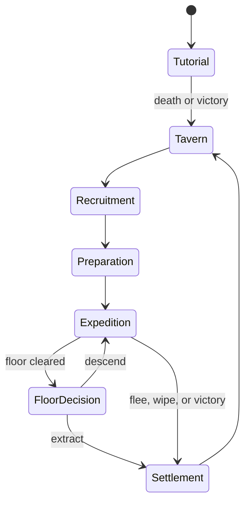

# Tavernbound — Game Loop Plan (Condensed)

> Condensed from `GameLoop_Implementation_Plan.md`. Prose tightened to bullets, dev asides and repeated filler removed; all formulas, tables, and numeric targets preserved.

---

## 1. Concept

**Core fantasy:** Turn an unreliable roadside tavern into a legendary adventurer haven by recognizing potential, taking calculated risks, and bringing heroes home alive.

**Premise:** Player runs a tavern/adventurer guild. 

Each cycle: Pick your adventurer from your roster -  Go on an adventure - Hope to return and pay off your tab with the tavern keeper and retire happily -  die you get nothing

**Design pillars**
1. Informed uncertainty — recruit qualities are hidden but discoverable through play, not loot-box RNG.
2. Preparation matters — food/drink/lodging/equipment/composition affect a run without predetermining it.
3. Extraction creates tension — every floor ends with bank-vs-risk.
4. Characters create history — traits, items, memories and future families
5. Tavern is the progression spine — expeditions fund the tavern; the tavern expands strategic options, not just numbers.

**Player roles:** Tavern keeper (strategy layer) + direct control of the active adventurer during expeditions. Adventurers are persistent roster characters, not autonomous timers.


---

## 2. Loop Hierarchy

| Loop | Length | Steps |
| --- | --- | --- |
| Moment-to-moment combat | 5–20s | Read threats/cooldowns/status → dodge, position, and trigger actions in real time |
| Room | 1–4 min | Enter & reveal room type → resolve encounter/event/merchant/hazard/camp/treasure → receive rewards/consequences → choose next room |
| Floor | 10–20 min | Generate floor from dungeon profile at current depth → traverse managing health/supplies/durability/effects → defeat floor boss → choose Extract / Descend / special route |
| Expedition | 25–60 min | Select destination + objective → prepare adventurer → clear floor(s) → extract/complete/flee/wipe → settle rewards, tabs, injuries, death, relationships, unlocks |
| Tavern cycle | 8–15 min | Receive returning adventurer + results → run service phase → recruit/assess/dismiss/socialize → craft/repair/buy/sell/upgrade → select next expedition + prepare adventurer |
| Campaign | 8–20 hrs (first completion) | Expand tavern Tier 0→5 → master Forest/Crypt/Hell → build a hero capable of the final Hell expedition → resolve former-keeper storyline (win path only) → continue into higher difficulty/seasonal/legacy content |

---

## 3. Canonical State Flow



- Single authoritative campaign state machine. UI can vary, but state transitions occur **only** through validated commands (`begin_recruitment`, `launch_expedition`, `extract_adventurer`, `settle_expedition`), preventing double-application of costs/rewards on scene reload.
- **Saves:** autosave at every room on first exit and on return to Tavern; save retains all items/equipment and full player state (HP, etc.).
- **Save-scumming:** penalized on repeated detected infractions.

---

## 4. Tutorial

**Goal:** teach combat, extraction, death, and the tavern premise in ≤5 min per section. Outcome may branch narratively but must converge mechanically — neither success nor failure should be the optimal metagame choice.

**Sequence**
1. Preset adventurer enters the Forest.
2. Teach movement, basic attack, special action, defensive reaction, consumables, room rewards.
3. If you complete the boss its time to go home.
4. Tutorial ends in victory or death.
5. Player takes over the tavern:
   - Tutorial Death: Currrent tavern keeper gets nothing, decides to start training a new hero.
   - Tutorial Victory: old keeper is bankrupt, Dissapears and the tavern sould for boss haul by mayor.
6. **Both outcomes grant identical starting state:** Tavern Tier 0, 120 gold, 8 supplies, one Fighter + one Mage candidate, one basic weapon each, former keeper's hidden letter.
- Branch only changes dialogue, a cosmetic keepsake, and one later encounter — never starting power.

---

## 5. Tavern Cycle

One cycle = one evening + following morning, five phases:

**A — Return & settlement:** confirm extracted loot → move to inventory (space-limited, needs upgrades) → update dungeon progress/Favor/quests/codex/unlocks → show ledger. Hall of heroes

**B — Tavern service:**
- `service_slots = 2 + room_tier + floor(reputation / 25)`
- `service_profit = base_price × quality_multiplier × satisfaction_multiplier − ingredient_cost`
- Quality multiplier by recipe tier: 1.00 / 1.25 / 1.55 / 1.90 / 2.30
- Satisfaction multiplier: 0.75–1.25 (preference match + event outcome)
- Target: daily service income = 15–25% of expected safe-expedition profit at same tier.

**C — Recruitment & assessment:**
- `candidate_count = clamp(2 + room_tier + event_bonus, 2, 7)`
- `candidate_power_budget = region_baseline + 0.6 × tavern_reputation + random(-variance, +variance)` — budget shapes stats but never guarantees a coherent build; higher tiers improve the mean, don't eliminate weak/eccentric recruits.
- Interaction types reveal information (band/comparison/tag/exact value depending on success): Observe (trait/equipment detail), Conversation (motive/preference/personality), Serve favored food/drink (aptitude band), Tavern event (contextual stat/trait test), Specialist appraisal (exact value, at cost).
- Example event (arm-wrestling): compare candidate STR vs. benchmark + small roll → win reveals `STR < benchmark` + 3–6 gold; tie reveals exact STR. **Revealed statements must never be falsified after the fact.**
- Presentation minimum: class, approx. level, visible equipment, one trait, one stat band — free. Paid/risky interactions reveal more.
- `Q = clamp(N(35 + 6 × tavern_tier + 0.25 × reputation, 15 − tavern_tier), 5, 95)` — maps to stat budget, trait quality, equipment tier **independently** (don't let all three scale together).
- Roster: base capacity 6, +2 per room upgrade tier; recovering/training/service-assigned heroes count against capacity, temporary quest guests do not.
- Dismissal is free pre-recruitment; dismissing a signed adventurer settles guaranteed wages or triggers a loyalty penalty.

**D — Roster & tavern management:** recruit (room + tab agreement), release (free if no unresolved contract), assign recovery/training/service/expedition, buy/sell/craft/enhance/repair, purchase upgrades, review rumors/quests/forecasts/boss traits.

**E — Expedition preparation:** choose region/depth/objective/difficulty → select the one adventurer to send → equip items/loadout → buy provisions (tab or funds) → review danger/reward/liabilities → confirm launch. **No unannounced costs after confirmation.**

---

## 6. Adventurer Model

**Persistence:** roster members stay until death, retirement, dismissal, or narrative departure; survivors can be resent repeatedly subject to fatigue/injury.

**Core data per adventurer:** identity (name, portrait, age band, origin, pronouns); class + rank; level/XP; core stats (Vitality, Strength, Finesse, Intellect, Resolve, Speed); 4 equipped actions (Basic/Special/Defensive/Movement); traits (2 visible, 0–2 hidden); equipment/consumables; current HP/fatigue/stress/injury/morale; loyalty + affinity/rivalry; outstanding tab/contract terms; history/scars/accomplishments/retirement state.

**Derived stats:**
Str - Smash Tomato                                   Level 3+ 1d4                                 Level 5+ 1d8                                 Level 7+ 1d8
Cha - Sell the Tomato                                Level 3+ 1d4                                 Level 5+ 1d8                                 Level 7+ 1d8
Dex - Dodge a Tomato                                 Level 3+ 1d4                                 Level 5+ 1d8                                 Level 7+ 1d8
Int - Know its a fruit                               Level 3+ 1d4                                 Level 5+ 1d8                                 Level 7+ 1d8
Wis - Know it doesnt belong in a fruit salad         Level 3+ 1d4                                 Level 5+ 1d8                                 Level 7+ 1d8
Con - Ability to eat it without vomiting             Level 3+ 1d4                                 Level 5+ 1d8                                 Level 7+ 1d8 

Different Classes use Different Stats for damage

Str = 1-3 = 1 Dmg / 4-6 = 2 dmg / 7-9 = 3 Dmg / 10 = 4 Dmg
Dex = 1-3 = 1 Dmg / 4-6 = 2 dmg / 7-9 = 3 Dmg / 10 = 4 Dmg
Cha = Trade Discounts and Dialogue Options in Tavern to Complete more mini Games (Anyone got anything else for Charisma?) 
Int = 1-3 = 1 Dmg / 4-6 = 2 dmg / 7-9 = 3 Dmg / 10 = 4 Dmg
Wis = 1-3 = 1 Dmg / 4-6 = 2 dmg / 7-9 = 3 Dmg / 10 = 4 Dmg
Con = 1-2 = 2Hp / 3-5 = 3Hp / 6-9 = 4Hp / 10 = 5Hp
---

## 7. Recruitment, Information & Fairness

- Hidden property knowledge states: `Unknown → Hint → Band → Exact`.
- Example Strength bands: Frail 1–3, Average 4–6, Strong 7–9, Exceptional 10+.
- Free presentation always includes class, approx level, visible equipment, one trait, one stat band.

*(See Section 5C above for interaction types and the recruit-quality formula — consolidated there to avoid duplication.)*

---

## 8. Tab & Contract Economy

Design goal: understandable risk/reward, not hidden pay-to-maybe-win.

**On the tab:** recruitment signing cost, room & board, food/drink buffs, tavern-supplied consumables, rented equipment, healing/repair/specialist services. UI always shows each adventurer's exact outstanding tab.

**Settlement waterfall:**
- `hero_liquid_value = extracted_gold + sold_loot_value + objective_bounty`
- `hero_gross_share = hero_liquid_value × contract_share`
- Default split: tavern 40% / hero 60% (contract traits shift ±5–10pp).
- Repay tab up to gross share → pay remainder to the hero → carry unpaid tab forward (capped).
  - `tab_payment = min(outstanding_tab, hero_gross_share)`
  - `hero_take_home = hero_gross_share − tab_payment`
  - `tavern_revenue = tavern_share + tab_payment`
- On death: You lose it all. Maybe in future we hire a loot goblin to go out and try recover equipment but for now we leave it as lose all.

**Preparation loyalty bonus** (morale only, not hidden loot):
- `care_score = clamp((comfort_spend + preferred_item_value) / expected_spend, 0, 2)`
- <0.5: −10 morale · 0.5–0.99: none · 1.0–1.49: +5 morale · 1.5+: +8 morale, +1 loyalty on safe return.

**Guardrails:**
- Always ≥1 zero-cost recovery expedition/task available.
- Essential starter equipment can't be permanently lost with no substitute. We can always make starting equipment in house
- Tavern upkeep capped at 20% of expected safe-cycle revenue.
- Sell-back: 40% of base value, up to 60% with merchant upgrades.
- No negative gold; unpayable costs become debt only via explicit contract.

---

## 9. Expedition Structure

**Regions:**

| Region | Primary test | Signature pressure | Main rewards | Unlock |
| --- | --- | --- | --- | --- |
| Forest | Positioning/attrition | Roots, poison, wildlife | Food, wood, basic gear | Start |
| Crypt | Resource denial/control | Darkness, curses, undead revival | Relics, armor, magic components | Forest depth 3 boss |
| Hell | Burst survival/sacrifice | Heat, corruption, elite chains | Legendary gear, rare currency | Crypt depth 4 boss |

Each region supports multiple expedition lengths/objectives post-unlock (not a single linear staircase).

**Floor generation must guarantee:** one entrance + one exit/guardian; ≥1 valid route between them; a target mix of required/optional rooms; no key locked behind itself; no mandatory encounter exceeding threat budget; ≥1 resource-relief opportunity before a standard-difficulty boss; deterministic reconstruction from (campaign seed, expedition ID, floor index).

10-room floor default composition: 4 combat, 1 elite/hazard, 1 event, 1 reward, 1 recovery/camp or merchant, 1 entrance, 1 guardian/exit — vary per region/depth, don't force exact counts if that makes generation predictable.

**Threat/reward budgets:**
- `floor_threat = region_base × (1 + 0.22×(depth−1)) × difficulty`
- `boss_threat = 1.8 × average_required_encounter_threat`
- 65–75% of budget → required encounters, rest → optional branches. Scaling responds to depth/difficulty (not the adventurer's equipment) so progression feels real.
- `floor_reward = region_reward_base × (1 + 0.28×(depth−1)) × difficulty_reward_multiplier`
- Split: 35% gold/valuables, 30% equipment, 20% materials, 10% consumables, 5% Favor/special currency.
- Optional danger should over-reward: +25% threat → +30–40% expected value.

**Extract or descend:** show current extracted value, guaranteed-on-extraction items, adventurer's HP/fatigue/injuries/consumables/condition, next-floor threat band + modifiers, next-floor reward multiplier.

| Depth | Threat | Reward | Wipe loss pressure |
| ---: | ---: | ---: | ---: |
| 1 | 1.00× | 1.00× | Low |
| 2 | 1.22× | 1.28× | Moderate |
| 3 | 1.49× | 1.64× | High |
| 4 | 1.82× | 2.10× | Severe |
| 5 | 2.22× | 2.69× | Extreme |

Extraction guaranteed after a cleared floor unless a clearly disclosed curse/objective changes the rule.

---

## 10. Combat & Class Actions

Combat is real-time (bullet-hell), not turn-based — the player continuously moves, dodges, and fires actions rather than picking from a menu on a turn. Every class has 4 signature action slots:

| Slot | Purpose | Cadence |
| --- | --- | --- |
| Basic | Reliable, no-cost | Spammable, no cooldown |
| Special | Class payoff/setup | Cooldown/resource |
| Defensive | Reaction/damage prevention | Reaction window/cooldown |
| Movement | Class-flavored repositioning | Short cooldown |

Baseline classes: Warrior (Slash/Cleave/Parry/Charge), Mage (Missile/Cannon/Repel/Blink), Healer (Control strike/Empower/Recover/Dash), Tank (Bash/Reflection/Shield/Leap), Summoner (Command/Summon/Redirect or Cover/Mount).

Advanced progression unlocks slot *alternatives*, not an ever-growing action bar — one action equipped per slot before launch.

**Pacing targets:** ordinary combat 3–5 enemy waves, elite 5–7 waves, boss 7–10 phases (with phase changes); ordinary damage taken = 10–18% of the adventurer's max HP; a well-played standard floor consumes 35–55% of renewable resources.

---

## 11. Loot, Equipment & Inventory

**Rarity vs. item level:** rarity = affix complexity, item level = numeric magnitude.
- Common: 0 affixes · Uncommon: 1 · Rare: 2 · Very Rare: 2 + build-changing property · Legendary: named, unique, rule-changing.

**Generation:**
- `item_level = region_level + depth − 1 + random(-1, 1)`
- `base_stat = slot_coefficient × (4 + 1.6×item_level)`
- Affixes drawn from tagged pools; weighted sampling without replacement; reject mutually-exclusive or redundant combos.

**Ownership:** tavern-purchased/crafted gear stays tavern property, freely reassignable. Personal quest items belong to the adventurer, may become heirlooms on death/retirement.

**Inventory pressure:**
- Expedition pack: 12 base slots, modified by items and upgrades.
- Stackable materials: 1 slot per material type.
- Equipping removes an item from pack usage.
- Full pack: acquiring new items requires replace/consume/drop.
- Tavern storage: 40 slots base, expands via upgrades.

---

## 12. Tavern Upgrades & Meta-Progression

| Branch | Immediate effect | Strategic effect |
| --- | --- | --- |
| Rooms | Roster capacity + recovery | More candidates, parallel recovery |
| Kitchen | Better food buffs | Attrition resistance, service profit |
| Cellar | Better drink/event options | Morale, information, social outcomes |
| Armory | Storage + equipment access | Loadout flexibility |
| Blacksmith | Repair + physical crafting | Gear retention, specialization |
| Arcanist | Identification + enchantment | Magic builds, curse management |

- `upgrade_cost(branch, tier) = round(base_cost_branch × 2.15^(tier−1))`
- Base costs: Rooms 150, Kitchen 120, Cellar 100, Armory 180, Blacksmith 220, Arcanist 260.
- Higher tiers may also require a region material/quest (gold alone shouldn't solve everything).

**Reputation (0–100):** affects candidate volume/quality/events/merchant access.
- `reputation_gain = objective_rep + boss_rep + survivor_bonus − abandonment_penalty`
- Milestone unlocks at 10/25/45/70/90. Not spendable — a standing record, not another currency.

**Dungeon merchants & Favor:** each region has a merchant found in expeditions; visits the tavern after that region's first boss clear.
- Gold buys currently stocked goods; Favor unlocks stock tiers + a few unique rewards.
- Favor earned from region objectives, discoveries, rescues, boss clears; it's a threshold gate, not spent on ordinary stock (only explicitly marked unique rewards cost Favor).
- `merchant_tier = highest tier where favor_requirement ≤ region_favor AND depth_requirement ≤ deepest_clear`

---

## 13. Relationships & Long-Term Outcomes

We spoke about this in the brainstorm. When a adventurer returns they retire and have a % chance of after 4 seasons there offspring can return to the tavern to begin there adventure
This ties in familiarity and watching a family grow through the generations

---

## 14. Content Architecture & Design Patterns

**Data-driven definitions** (Resources or equivalent, separate from runtime state): `AdventurerDefinition`, `ActionDefinition`, `TraitDefinition`, `ItemDefinition`, `RoomDefinition`, `EncounterDefinition`, `EventDefinition`, `DungeonProfile`, `UpgradeDefinition`. Runtime instances = IDs + mutable state only; never duplicate full definitions into save data.

**Patterns to use:**
- Finite-state machine — campaign/tavern phase/expedition/encounter/action resolution.
- Command pattern — player actions & economy transactions (validation, logging, replay, undo).
- Event bus/signals — outcome notifications (`hero_down`, `room_cleared`, `reputation_changed`); not for direct queries.
- Strategy pattern — damage formulas, targeting/AI behaviors, dungeon generators.
- Composition over inheritance — actions apply reusable effects (Damage, Push, Status, Summon, Heal, Shield).
- Weighted tables with conditions — traits, rooms, events, items, encounters.
- Transaction object — recruitment/purchases/expedition launch/settlement validate affordability and commit atomically.
- Deterministic random streams — separate named RNG per: dungeon layout, combat, loot, candidates, narrative events.

**Action resolution pipeline:** validate (actor/target/cost/range/cooldown) → reserve cost → create `ActionContext` (source, targets, seed, modifiers) → apply ordered effects → emit domain events → resolve reactions by priority → commit state + log → check downed/death/victory/room completion.

**Modifier order (one consistent formula everywhere):**
`final = max(floor, ((base + flat_additions) × additive_multiplier) × multiplicative_modifiers)` — sum within a layer, multiply across layers. Show the breakdown in dev tools and key player-facing previews.

---

## 15. Procedural Generation

`generate_floor(profile, seed, depth, objective) -> FloorGraph` — a shared interface across styles. `FloorGraph` = nodes, connections, room assignments, locks/keys, encounter seeds, validation metadata.

**Generator strategies:** Mystery dungeon (grid-carving, rooms + corridors), Field dungeon (authored templates in a spatial graph, Isaac-style), Spire dungeon (visible branching node graph, path selection). All share the same room/encounter/reward/extraction/settlement contracts — style changes navigation only, never the economy.

**Pipeline:** create topology within size/branching bounds → mark entrance/mandatory route/guardian/exit → place locks/keys/objectives via dependency checks → assign room types (weighted quotas + adjacency) → allocate threat/reward budgets → instantiate region content → run reachability/budget/dependency/content validators → retry with derived seed (fixed cap), else load a safe fallback. **Never let generation produce an unwinnable floor.**

---

## 16. Difficulty, Balance & Anti-Frustration

**Modes (transparent modifiers only — never silently change hit rolls/loot based on success):**
- Story: threat 0.80×, recovery 1.25×, reduced wipe loss.
- Standard: baseline.
- Veteran: threat 1.15×, scarcer relief, rewards 1.15×.
- Ascension: stacking authored modifiers, post-campaign.

**Target economy per tier — a safe expedition should fund:** one immediate consumable restock, one equipment decision per 1–2 cycles, one major tavern upgrade per 3–5 successful cycles.
- `net_cycle_gain = expedition_revenue + service_profit − provisions − repairs − healing − upkeep`
- Balance around the median, then test the 10th percentile — a player with two bad runs must retain a credible recovery path.

**Bad-luck protection:**
- Guaranteed compatible recruit after 2 cycles without one.
- Pity counter on boss-specific key drops.
- Critical crafting materials purchasable (inefficient price) after first discovery.
- Rescue expedition recovers lost equipment. Loot Goblin
- Repeated failed objectives reveal more info over time; don't directly reduce difficulty unless the player opts in.

---

## 17. Telemetry & Balance Diagnostics

**Track:** cycle/tier; candidates generated/inspected/recruited/rejected; gold sources/sinks by category; tab issued/repaid/carried/written off; adventurer loadout; rooms entered, damage taken, resources spent, encounter duration; extraction depth, carried/secured value, end reason; injuries/deaths/recoveries/dismissals; upgrade purchase timing.

**Key ratios:**
- `sink_ratio = total_gold_spent / total_gold_earned` → target 0.70–0.90 over successful cycles.
- `extraction_rate(depth) = extractions_at_depth / floor_clears_at_depth`
- `wipe_rate = wipes / expeditions` → target ~8–15% on Standard post-onboarding.
- `roster_churn = (deaths + dismissals) / recruited_heroes`
- `decision_balance(option) = option_selection / times_offered` → >80% selection flags an option as mandatory/underpriced/insufficiently situational.

---

## 18. Edge Cases & Required Rules

- No living adventurers → grant 2 free desperate recruits + low-risk recovery contract.
- No gold → free basic meal, starter gear loan, recovery expedition stay available.
- Roster full → candidates assessable but not signable; warn before spending an interaction.
- Wipe on mandatory story mission → preserve story key, offer recovery route, never soft-lock.
- Merchant unlocked before its facility exists → appears as a limited-stock visitor.
- Upgrade completes mid-recovery → recalculate future ticks only, never retroactively.
- Save loaded after content update → preserve unknown IDs as inert placeholders + compensation, never fail load.
- Duplicate settlement call → reject via the expedition's committed settlement ID.
- Invalid generated floor → deterministic retry, then handcrafted fallback.

---

## 19. MVP Scope & Build Order

**Vertical slice content:** Tavern Tier 0–1 · 8 actions/class (4 default + 4 alt) · Forest region, 3 depths, one generator style · 12 enemies, 3 elites, 2 bosses · 25 items, 12 traits, 15 tavern events · recruitment assessment, tab settlement, extraction, injury/death, 4 upgrades.

**Build order:**
1. Domain model + deterministic RNG (adventurer, item, action, expedition, settlement, save IDs).
2. Combat sandbox (1 room, 4 classes, enemies, effects, reactions, victory/death).
3. Floor graph + traversal (generation validation, reward budget, boss, extract/descend).
4. Expedition settlement (loot states, tabs, injuries, death, atomic save).
5. Tavern cycle (candidates, assessment, recruitment, service, roster, preparation).
6. Progression (upgrades, reputation, merchants, Favor, unlock prerequisites).
7. Content tooling (data validation, encounter preview, economy simulator, seeded replay).
8. Narrative wrapper + tutorial — only after the full loop is playable without story.
9. Balance & accessibility (difficulty modes, tooltips, input support, pacing).
10. Additional dungeon styles/regions (Crypt, Hell, Mystery, Field, Spire).

**Vertical-slice success:** a new player completes 5 tavern cycles, can explain a recruitment choice and how the tab was repaid, makes ≥1 difficult extraction decision, recovers from a failed expedition, and buys a tavern upgrade — all without developer explanation.

---

## 20. Testing Plan

**Automated:** formula boundary tests (mitigation, crit caps, tabs, death chance, upgrade costs); property tests (floors connected + completable); economy tests (settlement conserves value, never double-pays); save/load round trips per campaign state; determinism (same seed/inputs → same floor/combat/loot); content validation (unique IDs, valid references, positive weights, supported effects).

**Simulation:** ≥10,000 automated cycles under simple policies (always extract after 1 floor; descend while HP >75%; always descend; spend minimally; spend generously) — compare bankruptcy, upgrade timing, wipe rates, roster churn, dominant strategies. Identifies broken curves before playtesting; doesn't replace it.

**Playtest questions:** Can the player explain preparation cost vs. benefit? Did hidden recruit info create curiosity or irritation? Was extraction tempting both ways? Did failure create a new plan instead of a dead end? Did heroes feel distinct beyond class/stats? Did tavern upgrades change decisions, or just increase output?

---

## 21. Tunable Configuration

Keep balance values outside code, in one versioned config asset:

```yaml
economy:
  starting_gold: 120
  tavern_share: 0.40
  sell_rate: 0.40
  upkeep_income_cap: 0.20
expedition:
  base_pack_slots: 12
  floor_threat_growth: 0.22
  floor_reward_growth: 0.28
  secured_reward_rate: 0.25
combat:
  damage_variance_min: 0.90
  damage_variance_max: 1.10
  base_crit_chance: 0.05
  crit_multiplier: 1.50
recruitment:
  base_roster_capacity: 6
  minimum_candidates: 2
  maximum_candidates: 7
recovery:
  fatigue_per_floor: 20
  base_rest_recovery: 35
```

Every balance change updates a config version stored in the save + telemetry, keeping test results comparable.

---

## 22. Deferred Decisions (post-vertical-slice)

- Calendar/seasonal dungeon visuals & modifiers.
- Adventurer households, children, descendants.
- Advanced aging/retirement simulation.
- Multiple simultaneous expedition teams.
- Tavern layout decoration/construction placement.
- Asynchronous/autobattled expeditions.
- Endless ascension and daily seeded challenges.

**Core question the slice must answer:** Is evaluating and investing in persistent adventurers, then deciding how far to risk them in a dungeon, compelling across repeated tavern cycles?

---

## 23. Immediate Developer Checklist

- [ ] Stable IDs: campaign, adventurer, item instance, expedition, settlement.
- [ ] Seeded named RNG streams.
- [ ] Adventurer stats + 4-slot action loadout.
- [ ] Effect-composition combat pipeline.
- [ ] Downed / stabilized / injured / dead / recovering states.
- [ ] Floor graph with validation + safe fallback.
- [ ] Secured vs. unsecured loot.
- [ ] Extract / flee / wipe / victory outcomes.
- [ ] Exact tab ledger + settlement waterfall.
- [ ] Candidate knowledge states + truthful reveals.
- [ ] Atomic transactions + autosave boundaries.
- [ ] Data validation + balance configuration.
- [ ] Developer combat log, economy ledger, seed replay.

Once these exist, remaining work is mostly content authoring and tuning, not foundational rework.
